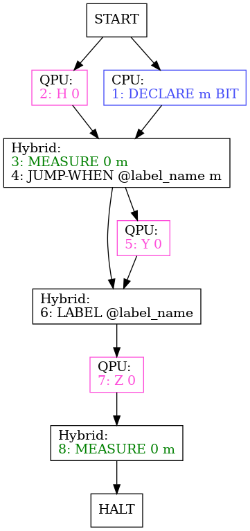

<!--
SPDX-FileCopyrightText: 2025 Lian Remme <lian.remme@dlr.de>

SPDX-License-Identifier: CC-BY-3.0
-->


[](https://shields.io/)

# Quil Parser & Analyser

This project parses, analyses and optimizes Quil code. 
It is part of my master's thesis “Optimization Strategies for Quantum Computers in Distributed Systems”.

The Quil code, control flow graphs, and data-dependence graphs relevant to my master's thesis can be found at `src/main/resources/QuilExampleFiles`.
The optimization results refered to in my thesis are available at [Zenodo](https://doi.org/10.5281/zenodo.14823715).

The main focus of the project is to examine real-time quantum calculations, i.e. quantum calculations with classical feedback within the coherence time of the qubits.
The project analyzes Quil files and creates Control Flow Graphs (CFGs) and Data dependence Graphs (DDGs) of the Quil code.
It can apply optimization procedures to the Quil code.

## Table of Contents
- [The Quil Language](#the-quil-language)
- [Analyzation of Quil Programs](#analyzation-of-quil-programs)
  * [Control Flow Graphs (CFGs)](#control-flow-graphs-cfgs)
  * [Data Dependence Graphs (DDGs)](#data-dependence-graphs-ddgs)
- [Optimization of Quil Programs](#optimization-of-quil-programs)
  * [Constant Propagation](#constant-propagation)
  * [Live-Variable Analysis](#live-variable-analysis)
  * [Constant Folding](#constant-folding)
  * [Dead Code Elimination](#dead-code-elimination)
  * [Finding Hybrid Dependencies](#finding-hybrid-dependencies)
  * [Instruction Reordering](#instruction-reordering)
  * [Latest Possible Quantum Execution](#latest-possible-quantum-execution)
  * [Applying the Optimization Strategies](#applying-the-optimization-strategies)
- [Metrics to Evaluate Quil Programs Against](#metrics-to-evaluate-quil-programs-against)
  * [Wall time](#wall-time)
  * [Quantum instruction number (QIN):](#quantum-instruction-number-qin)
  * [Quantum calculation time (QCT)](#quantum-calculation-time-qct)
- [Compile and Run](#compile-and-run)
- [Citation](#citation)
- [Supplementary Materials](#supplementary-materials)
- [License](#license)

## The Quil Language

Quil is a quantum instruction language developed by Rigetti Computing (https://github.com/quil-lang/quil). 
It is an instruction set architecture (ISA) for quantum computers.

In Quil, integer indices are used to refer to qubits.
Qubits do not need to be declared upfront.

Quil supports four classical variable types: `BIT`, `OCTET`, `INTEGER`, and `REAL`.
Classical variables need to be declared before usage, e.g. `DECLARE a BIT` to declare a bit value of the name `a`.
Afterward, the value can receive a value (`MOVE a 0`) and be used in classical instructions.

Classical variables can be declared as an array, e.g. `DECLARE a BIT[2]`.
The values can then be accessed by `[n]`, e.g. `MOVE a[1] 0`.

Quil offers different categories of instructions, namely
- **quantum gates**: Instructions that name a gate and at least one qubit that is applied to the gate, e.g. `H 0`, or `CNOT 0 1`.
- **classical instructions**: Calculations applied on classical variables. The classical instruction set is turing-complete.
- **parameterized quantum gates**: Quantum gate instructions with gates that receive a classical parameter, e.g. `RZ(angle) 0`, with the classical parameter `angle`. Quantum gates that receive a fixed value (e.g. `RZ(1.57)`) do not count as parameterized.
- **measurements**: Instructions that measure the value of a qubit. The value can be saved in a classical parameter. E.g.: `MEASURE 0 ro[0]`.
- **control structures**: One can define labels (`LABEL @label_name`) and jumps in Quil. Jumps can be conditional (e.g. `JUMP-WHEN @label_name cond`) or unconditional (e.g. `JUMP @label_name`).

Quantum gates that are not parameterized can be exclusively executed by a QPU and are therefore *quantum instructions*.
Classical instructions can be exclusively executed by a CPU and are therefore *classical instructions*.
All other instructions need to be executed by QPU and CPU at the same time, and are therefore *hybrid instructions*.

## Analyzation of Quil Programs

The project creates Control Flow Graphs (CFGs) and Data dependence Graphs (DDGs) of Quil programs.

### Control Flow Graphs (CFGs)

A CFG represents all possible execution paths of a program.
The directed edges of the graphs represent jumps.
The nodes describe a basic block, which are “sequences of statements that are always executed one-after-the-other, with no branching” [Aho et al., Compilers: Principles, Techniques and Tools, Chapter 2.8.1].
This means that a jump on the current instruction as well as a label (jump target) at the next instruction ends a basis block.

Each node/basic block of the \CFG consists of either only quantum instructions, classical instructions, or hybrid/control structures.
Quantum and classical instructions that are executed without a hybrid/control instruction in between are written into two parallel basic blocks.

For example, the Quil code
```
DECLARE m BIT
H 0
MEASURE 0 m
JUMP-WHEN @label_name m
Y 0
LABEL @label_name
Z 0
MEASURE 0 m	
```
results into the CFG:


### Data Dependence Graphs (DDGs)

A DDG is a directed graph.
Nodes represent basic blocks (or, in our case, single instructions) of a program.
An instruction $A$ is a successor of instruction $B$ in the graph, if $A$ has to be executed after $B$ in order for the program to be correct, e.g. if $A$ and $B$ access the same variable.
Edges only appear between instructions/nodes if no other instruction $C$ has to be executed between $A$ and $B$.

Every node of the DDG holds a single Quil instruction.
The edges indicate which instructions have to be executed before their instruction can be executed.
This is done by checking variable dependence.
Unconditional jumps are resolved before creating the DDG and not listed as nodes.

Conditional jumps in the program pose a problem to the DDG.
If a conditional jump targets an already executed line, it introduces circular dependencies.
This could only be resolved exactly if we knew the number of iterations, which would be analogous to solving the Halting problem, and therefore not generally possible.

We resolve this issue by creating a DDG only up to the next conditional jump.
By that, we can receive multiple DDGs for a single program, all depicting a part of the program.
One of the DDGs is the start DDG, which is the DDG describing the entry of the program.
Additionally, we have one or multiple halt DDGs, which include the program instructions last executed before the program terminates.

As an example, 
```
DECLARE m BIT
H 0
MEASURE 0 m
JUMP-WHEN @label_name m
Y 0
LABEL @label_name
Z 0
MEASURE 0 m	
```
results into the DDGs:


## Optimization of Quil Programs

The project offers different optimization strategies for Quil programs.

### Constant Propagation

For the classical part of the code, the algorithm works as follows:
A classical value is recognized as constant by a `MOVE` instruction if the instruction moves a constant value onto it.
`MOVE a 10` results into `a` having the constant value $10$.

A variable remains constant until it is being written to again.
`ADD b a` writes and reads `b`, but only reads `a`, thus `a` remains constant.
This means the algorithms recognizes `b` to be constant at the reading part of the instruction, but `b` looses its constant state afterward.
This would even hold if `a` was replaced by a constant value.
Constant folding will replace the instruction by a `MOVE` instruction if `a` and `b` were constant.

For the quantum part of the code, we restrict ourselves to the Pauli-basis and single qubit gates.
A qubit is constant at the start of the program and after a `RESET` with the value `Pauli X Zero`.
The constant propagation checks at which instructions a constant qubit “arrives” with a specific value, either because it has been initially used or reset before, or because constant folding has shown that it remained in a constant Pauli basis after a gate application.

### Live-Variable Analysis

A classical variable counts as dead if it is written to and the value of the variable is not read until the variable's value is overwritten.
For the application of the algorithm, we need to know which classical variables hold *readout values*, i.e. which values need to be reported back to the main CPU at the end of the quantum program.
These variables are by default alive at the end of the program, which is handled as if there was an additional read of the variable after the halt of the program.

A quantum variable counts as dead if its information content does not influence any classical information from the current instruction until the end of the program.

The quantum variable can safely be called dead at a program point `p` if it is
- not used by any multi-qubit gate, **and**
- not measured

until
- the end of the program, **or**
- the next reset.

These conditions even hold if the instruction at `p` is a measurement, as long as this measurement is not saved in a classical variable.

### Constant Folding

In classical instructions, all constant values that are read are replaced by their constant values. 
This means, e.g., `ADD a b` is replaced by `ADD a 10` if `b` has a constant value of $10$.
The same holds for parameterized quantum gates. 
If the classical parameter is constant, it is replaced by the constant value.

If a value that is written to is constant and additionally, all read values in the instructions are constant, the instruction is replaced by a `MOVE` instruction.
As example: If `a` is $5$, `b` is $7$ and the instruction is `ADD a b`, it is replaced by `MOVE 12` as `a` would be $12$ after the addition.

For the quantum part of the program, constant folding calculates the result of the application of a gate on a qubit.
This is only calculated if the qubit is constant beforehand (i.e. in a Pauli basis, as defined by constant propagation) and a single-qubit Clifford gate acts on it.
We calculate the next Pauli state and still assume the qubit as constant (in the respective Pauli state).

Constant folding for quantum variables can be done efficiently for Clifford gates (due to the Gottesman-Knill theorem).
To avoid dealing with entangled states during constant propagation, we generally assume qubits to be non-constant after a multi-qubit gate.

Due to this, we only trace the constant value of a qubit until the first non single-qubit or non-Clifford gate acts on it.
This means we are tracing the six Pauli basis state as values of the qubits.

Measurements are in general considered to be random and write non-constant values in the classical values.
The only exception is if we know that a qubit is either in the $0$ or $1$ state.
In that case, the classical value receives the constant value $0$ or $1$.

### Dead Code Elimination

We use the results of the live-variable analysis of which variables are dead.
Classical code is dead if all variables written to in the instruction are dead.
Quantum code is dead if all quantum variables an instruction acts on are dead
All dead instructions are deleted.

### Finding Hybrid Dependencies

Finding hybrid dependencies checks which instructions have to be executed before a hybrid node becomes executable.
This analysis first finds all hybrid instructions, and afterwards determines which instructions have to be executed before the respective hybrid instruction by using the DDG.
A hybrid instruction can have other hybrid instructions as dependencies.
A hybrid instruction blocks the instruction dependencies for all other hybrid instructions.

For example
```
DECLARE m INTEGER[1]
H 0
MEASURE 0 m
RZ(m) 0
```
contains the hybrid instructions `MEASURE` and `RZ(m)`.
All other lines have to be executed before `RZ(m)`.
But the only direct dependence we save for it is `MEASURE`, as `MEASURE` is a hybrid instruction and depends on `H` and the `DECLARE` instruction as well.
For `MEASURE`, the dependencies `H` and `DECLARE` are saved.

### Instruction Reordering

This can be done as long as instructions dependent on each other are still in the same order.
The DDG provides us information about the dependent instructions.

The goal is to reorder the instructions to maximize the number of parallel executions of the CPU and QPU.
In other words, the time in which only one device is calculating and the other one is idling should be minimized.

The two devices only influence each other through hybrid nodes.
To prevent long waiting times of one device for the other, we use the knowledge we gained from the DDG and the finding hybrid-dependence analysis.

If the CPU or the QPU have to wait for the other device before a hybrid instruction, the algorithm aims to avoid that the waiting device does not execute instructions.
It is checked whether there are instructions for the waiting device that can already be executed, i.e. for which all dependencies have been executed.
If this is the case, the waiting device can to execute the instructions while waiting instead of doing nothing.

### Latest Possible Quantum Execution

To keep the total execution time of the quantum device small.
The goal of this algorithm is to execute as many classical instructions as possible before the QPU starts to work.
For this, the execution of instructions is reordered in the following way:
- All classical instructions that are not dependent on quantum device are executed at the start.
- The first quantum instruction is executed such that QPU and CPU reach the first hybrid node simultaneously. This is again done with the assumption that each instruction has an execution time of $1$.

### Applying the Optimization Strategies

Determining the best order to apply optimization operations on a given code (phase-ordering) is an open question in classical compiler architecture.
Finding a sensible order is out of scope for this work, and we will simply draw operations to apply to the codes at random.
We do this $m$ times for a given Quil code and apply $n$ optimization operations every time.
While the operation drawing was random, certain analysis-transformation routines had to follow directly after each other, as certain analysis operations lay the groundwork for succeeding transformation operations.
The optimization routine consists of a permutation of the following operations succeeding each other:
- Constant propagation $\rightarrow$ constant folding.
- Live-variable analysis $\rightarrow$ dead code elimination.
- Finding hybrid-dependencies $\rightarrow$ instruction reordering.
- Finding hybrid-dependencies $\rightarrow$ Latest possible quantum reordering.

Which means we did $n/2$ random draws per optimization routine, rounded up.

The result of the optimization routine is a `.json` file containing the optimization steps and the optimized Quil code.

## Metrics to Evaluate Quil Programs Against

The Quil programs are evaluated against different metrics.

### Wall time

Considering that all instructions have the execution time $1$, it is assessed how long the program would take to execute.
Whenever possible, the CPU and QPU execute instructions in parallel.
Two parallel executed instructions receive execution time $1$ together.
At a hybrid or control instruction, one device waits for the other.

For example,

has a wall time of $7$.

The wall time is calculated for all DDGs of a program and summed up for comparison of syntactically different representations of the same program.

### Quantum instruction number (QIN):

Count the number of quantum instructions per DDG and sum the result up for comparison to other codes.
Hybrid instructions are included in the counting, as the QPU and the quantum state are considered during hybrid calculations.
Minimizing the QIN is sensible, as quantum instructions are more likely to introduce errors than classical instructions.

### Quantum calculation time (QCT)

As quantum states in a QPU have a limited coherence time, it makes sense to minimize the time the QPU has to keep the qubits coherent.
This value is the QCT.
As we assume that each instruction needs a time value of $1$, the time is given in units of the instruction number.

For the calculation of QCT, we assume the best case:
The QPU starts with the first quantum instruction on the latest possible time such that the CPU does not have to wait for the QPU at the first hybrid instruction.
Additionally, the QPU calculates the quantum instructions after the last hybrid instruction directly after the hybrid instruction.
Between the first and the last hybrid instruction, the wall time is equal to the time the qubits have to stay coherent.

It should be noted that a reasonable program has no quantum instructions after the last hybrid instruction.
This would only create quantum information which is destroyed again, as it would have to be measured for further usage.
Measurement, again, would be a hybrid instruction.

This results in a QCT $\tau_Q$ of $\tau_Q = \delta t_{between} + n_{q\_before} + n_{q\_after}$
with the wall time between first and last hybrid instruction (including these hybrid instructions) $\delta t_{between}$, the number of quantum instructions before the first hybrid instruction $n_{q\_before}$, and the number of hybrid instruction after the last hybrid instruction $n_{q\_after}$.

An example for calculating the summands is


## Compile and Run

First, the program needs to be compiled:
```bash
mvn package
```
It can be run afterwards with the following command:
```bash
java -cp target/quil-parser-analyser-1.0-SNAPSHOT.jar Main <path-to-Quil-file> <options>
```
The options are:
- `-cfg` to create the CFGs of the Quil code. The result is saved in a `.dot` and a `.ps` file. The files are saved as `<quil-filename>cfg.dot` and `<quil-filename>cfg.ps`.
- `-ddg` to create the DDGs of the Quil code. The result is saved in a `.dot` and a `.ps` file. The files are saved as `<quil-filename>ddg.dot` and `<quil-filename>ddg.ps`.
- `-optimize <readout-parameters>` to optimize the Quil code. The result is saved in a `.json` file. The file is saved as `<quil-filename>_optimization_fuzzing.json`. The `-optimize` option is followed by the readout parameters of the program.
- `-iterations m` to run the optimization routine `m` times. The default value is $500$.
- `-nOptimizations n` to apply `n` optimization operations in each optimization routine. The default value is $50$.

# Citation

If you use this project in your research, please cite it as follows:

```bibtex
@mastersthesis{optimizeQuil,
  author  = {Remme, Lian},
  title   = {Optimization Strategies for Quantum Computers in Distributed Systems},
  school  = {Heinrich Heine University Düsseldorf},
  year    = {2025},
  month   = {2}
}
```
# Supplementary Materials

The optimization results refered to in my thesis are available at [Zenodo](https://doi.org/10.5281/zenodo.14823715).

# License

The MIT License (MIT)

Copyright (c) 2025 Lian Remme <lian.remme@dlr.de>

The copyright of the in-memory ANTLR API (org.snt.inmemantlr) belongs to Julian Thome <julian.thome.de@gmail.com> and licensed under the MIT License (https://github.com/julianthome/inmemantlr).

Permission is hereby granted, free of charge, to any person obtaining a copy of
this software and associated documentation files (the "Software"), to deal in
the Software without restriction, including without limitation the rights to
use, copy, modify, merge, publish, distribute, sublicense, and/or sell copies
of the Software, and to permit persons to whom the Software is furnished to do
so, subject to the following conditions:

The above copyright notice and this permission notice shall be included in all
copies or substantial portions of the Software.

THE SOFTWARE IS PROVIDED "AS IS", WITHOUT WARRANTY OF ANY KIND, EXPRESS OR
IMPLIED, INCLUDING BUT NOT LIMITED TO THE WARRANTIES OF MERCHANTABILITY,
FITNESS FOR A PARTICULAR PURPOSE AND NONINFRINGEMENT. IN NO EVENT SHALL THE
AUTHORS OR COPYRIGHT HOLDERS BE LIABLE FOR ANY CLAIM, DAMAGES OR OTHER
LIABILITY, WHETHER IN AN ACTION OF CONTRACT, TORT OR OTHERWISE, ARISING FROM,
OUT OF OR IN CONNECTION WITH THE SOFTWARE OR THE USE OR OTHER DEALINGS IN THE
SOFTWARE.
